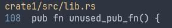

# cargo-workspace-unused-pub

This cargo subcommand tries to to detect `pub` methods that are unused in an entire workspace, by performing workspace-wide analysis.

The [`dead_code` Rust compiler lint](https://doc.rust-lang.org/rust-by-example/attribute/unused.html) ignores `pub` methods, given that:

- The linter operates crate-by-crate.
- Unused `pub` methods could be used in another workspace crate, or be part of a public API.

See also the following discussions about this problem:

- https://github.com/rust-lang/rust-clippy/issues/5828 (closed as Clippy does not perform workspace-level analyses).
- https://users.rust-lang.org/t/would-pub-workspace-be-possible/105503/2

## Usage

```console
$ cargo workspace-unused-pub --help
Detect unused pub methods in a workspace

Usage: cargo workspace-unused-pub [OPTIONS] [WORKSPACE]

Arguments:
  [WORKSPACE]  [default: current workspace]

Options:
      --scip <SCIP>
      --extensions <EXTENSIONS>  [default: rs,html]
  -h, --help                     Print help
  -V, --version                  Print version
```

## Implementation

Detection is performed in multiple phases:

1. Open [an SCIP code index](https://sourcegraph.com/blog/announcing-scip), or generate one with [rust-analyzer](https://rust-analyzer.github.io/).

   ```
   Opened SCIP file with 806 documents
   ```

   Note that the index generation can take a significant amount of time on large workspaces.

2. Record methods and traits declarations.

   ```
   Found 6722 declarations and 286 traits
   ```

3. Phase 1: Find all methods that are seem never used. The following phase aim at removing false positives.

   ```
   Pass 1: 1419 candidates
   ```

4. Phase 2: Remove false positives stemming from `main`, tests and trait methods.

   ```
   Pass 2 (mains, tests, trait methods): 189 candidates
   ```

5. Phase 3: Perform a text search to remove false positives due to e.g. use in HTML templates:

   ```
   Pass 3 (search): 43 candidates
   Found 43 possibly unused functions
   ```

   The extensions that are searched are defined by the `--extensions` flag.

6. Display results: \
   

The output of each phase (in the format above) can be viewed by setting the `RUST_LOG=debug` environment variable.

## Alternatives

- https://github.com/est31/warnalyzer, which relied on the removed nightly `save-analysis` feature, and therefore requires an older nightly compiler. See https://github.com/est31/warnalyzer/issues/9

## TODO

- Automatically remove the unused functions (assuming a clean git repository is found).
- Build an approxiamte SCIP index with tree-sitter instead of rust-analyzer, for faster execution (e.g. in CI).
- Allow ignoring false positives with a special code comment or attribute.
- Support other objects than only methods (e.g. constants).
- Robustify the detection of test/main functions.
